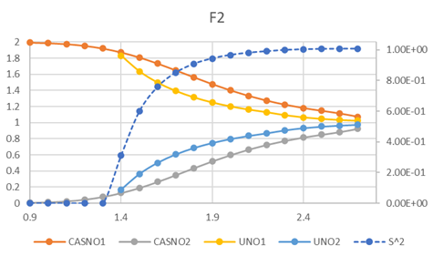

# Multireference Scan of Diatomic Molecules

## Simple Cases: H2, F2 and N2
As mentioned in the previous article, RHF stability and UNO occupation is highly important in choosing CASSCF strategy. Let's illustarte that by plotting $<S^2>$ and CASNO/UNO occupation number of three simple cases.

Here we can see that
|                      | CAS      |  H2      |   F2     |
| --- | --- | --- | --- |
|RHF stable, LUNO<0.02 | (0,0)    | <= 0.6   |  <= 1.0  |
|RHF stable, LUNO>0.02 | (2,2)    | 0.7 - 1.2| 1.1 - 1.3   |   
|RHF unstable, LUNO>0.02 |(2,2)   | >= 1.3   |  >= 1.4  |

